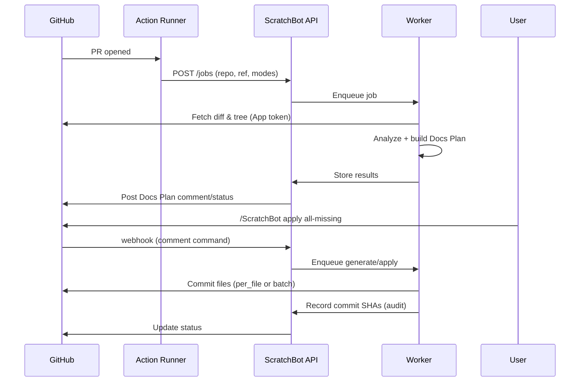

# PR ScratchBot — Technical Specification (v1)

**Author:** ChatGPT (based on user directives)
**Date:** 2025‑08‑09
**Status:** Draft v1 for implementation
**Audience:** Engineers (backend, frontend, DevOps), product, platform team

---

## 0) Executive Summary

A GitHub‑integrated system that, on pull requests (PRs), analyzes code diffs and the file tree to identify missing and outdated documentation for JS/TS and Python projects (initially monorepos). It posts a **Docs Plan** checklist to the PR, and—upon user approval via the GitHub UI or a separate Web UI—**commits Markdown docs** directly to the PR branch (per‑file commits or a single batch, configurable). A standalone Web UI (GitHub SSO only) also lets users kick off documentation jobs by branch or commit and open a “docs prompt PR” where they can specify targets like `@server.py` with hints (e.g., “focus on the API”).

Scope v1: GitHub only, JS/TS + Python, monorepos first, no forks, commit on current PR only, code‑grounded generation (optionally consults package registries for dependency context). Job metadata and audit events stored for up to 30 days; doc artifacts live in Git.

---

## 1) Goals & Non‑Goals

### 1.1 Goals

- **PR automation:** On `pull_request: opened` (and optionally `synchronize` later), compute a **Docs Plan**:

  - Checklist of **missing** docs.
  - List of **updates needed** with file paths and reasons.

- **Approval → write:** When approved, generate Markdown and **commit to the PR branch** (configurable: per‑file commit or one batch commit).
- **Web UI:** Start jobs outside Actions, including a “**docs prompt PR**” flow with file mentions (e.g., `@server.py`).
- **Monorepos:** Efficiently scan large repositories while staying under a **\~150k token** model budget; ask the user to prune when needed.
- **Dependency capability:** Optionally look up dependencies (npm/PyPI) to ground docs on external APIs used by the code.
- **Audits:** Record who/what/when for job runs, diffs proposed and applied, and commit SHAs.

### 1.2 Non‑Goals (v1)

- GitLab/Bitbucket integration.
- Fork PR support.
- Notifications, advanced RBAC beyond GitHub SSO, i18n/a11y.
- Vector database / embeddings index (may add later).
- Comments documentation (focus is on colocated `.md` files, READMEs, API/component/class docs).

---

## 2) Definitions & Glossary

- **Docs Plan:** The structured checklist comment/status containing “Missing” and “Needs Update” items, with paths, reasons, and estimates.
- **Job:** A single run of analysis/generation tied to a PR/branch.
- **Job Item:** A specific doc target (e.g., `packages/api/README.md`).
- **Commit Mode:** `per_file` or `batch` when applying generated docs to the PR branch.
- **Monorepo:** Repository with multiple packages/services (e.g., `packages/*`, `apps/*`).

---

## 3) High‑Level Architecture

```
+------------------------+        +-------------------------+
|        GitHub          |        |      Web UI (SSO)       |
|  - PRs & Actions       |        |  - Start jobs           |
|  - Webhooks (App)      |        |  - Review drafts/diffs  |
+-----------+------------+        +------------+------------+
            | (webhook)                         |
            v                                     v
       +----+-------------------------------------+----+
       |                API / Orchestrator             |
       |  - Auth (GitHub OAuth)                        |
       |  - GitHub App adapter (repo install)          |
       |  - Job mgmt, audits, estimates                |
       +------+---------------------+------------------+
              |                     |
              v                     v
        +-----+-----+          +----+-----------------+
        |   Queue   |          |  Workers (Model I/O) |
        | (Redis/SQS)|         |  - Diff parsing      |
        +-----+-----+          |  - Heuristics        |
              |                |  - Prompting         |
              v                |  - Dependency lookup |
       +------+-----------------+---------------------+
       |                 Git Adapter (libgit2)        |
       |  - Checkout PR branch                         |
       |  - Commit generated docs                      |
       +------+---------------------------------------+
              |
              v
       +------+----------------+
       |  Postgres (metadata)  |
       |  - Jobs, audits       |
       +-----------------------+
```

**Identity split (recommended):**

- **Web UI login:** GitHub **OAuth** (user identity).
- **Repo write/webhooks:** GitHub **App** installed per repository for least‑privileged tokens.

> _Note:_ If you prefer OAuth‑only, the service can use user PATs for write actions, but a GitHub App is best practice for install‑per‑repo and webhook handling.

---

## 4) GitHub Integration (Actions & App)

### 4.1 Triggers

- **Action event:** `pull_request` with `types: [opened]` (optionally add `synchronize` later for updates).
- **No forks** (ignored early via condition checks).

### 4.2 Permissions

- `contents: read` (for code), `pull-requests: write` (to post the Docs Plan and later commits via App/CLI helper).

### 4.3 Action YAML (starter)

```yaml
name: PR ScratchBot
on:
  pull_request:
    types: [opened]
    branches: ["**"]
permissions:
  contents: read
  pull-requests: write
jobs:
  ScratchBot:
    runs-on: ubuntu-latest
    steps:
      - uses: actions/checkout@v4
        with:
          fetch-depth: 0
      - name: Run ScratchBot analysis
        uses: your-org/ScratchBot-action@v1
        env:
          ScratchBot_SERVER_URL: ${{ secrets.ScratchBot_SERVER_URL }}
          ScratchBot_API_TOKEN: ${{ secrets.ScratchBot_API_TOKEN }} # issued by our service
          GITHUB_TOKEN: ${{ secrets.GITHUB_TOKEN }}
      - name: Post Docs Plan
        run: |
          # The action binary/CLI posts a summary comment + status
          ScratchBot cli post-plan \
            --server "$ScratchBot_SERVER_URL" \
            --job-id "$ScratchBot_JOB_ID" \
            --github-token "$GITHUB_TOKEN"
```

### 4.4 Docs Plan Surface (PR)

- **Single summary comment** pinned/updated in place.
- **Status check** (e.g., `ScratchBot/plan`) marked `neutral` (non‑blocking) with quick counts.
- **Formats:**

  - **Missing:** checkbox list with file suggestions (e.g., `packages/api/README.md`) and reasons (“>300 LoC and no README”).
  - **Needs Update:** paths with reason (e.g., “exported function signature changed: `getUser(id, opts?)`”).
  - **Estimates:** rough S/M/L effort and token estimate per item.
  - **Actions:** slash‑commands (`/ScratchBot apply all-missing`, `/ScratchBot apply path packages/api/README.md`, `/ScratchBot dismiss path ...`).

### 4.5 Commit Strategy

- Configurable **commit mode**: `per_file` (default) or `batch`.
- Commit messages (configurable template):

  - Per‑file: `docs: add ${relpath} (auto‑generated)`
  - Batch: `docs: apply Docs Plan (auto‑generated)`

- Commits are **authored by the GitHub App** with co‑authored‑by the approving user if initiated from Web UI.

---

## 5) Web UI (Jobs outside Actions)

### 5.1 Authentication & Access

- **GitHub OAuth** only. Access limited to collaborators on the selected repo.
- On first visit to a repo, require a **GitHub App install** (for write + webhooks) if not present.

### 5.2 Key Flows

1. **Start Analysis Job:** Select org/repo → branch/commit range (default HEAD) → filters: “Missing”, “Needs Update” → run.
2. **Docs Prompt PR:** Form with:

   - Target repo/branch or create new branch `ScratchBot/<slug>`.
   - **Prompt field** with `@file` mentions, e.g., `@server.py document this, focus on the API`.
   - Optional **docs directory** override.
   - Submit → new PR opened with description including the prompt and initial Docs Plan.

3. **Review & Apply:**

   - Item list with **diff preview** (Markdown rendered + side‑by‑side raw diff).
   - **Cherry‑pick** by file or **Select All (Missing/Update)**.
   - **Estimates** shown per item and aggregate.
   - **Apply** → commits to current PR branch using selected commit mode.

### 5.3 Rebase/Drift Handling

- If base branch moves, UI offers **Rebase & Recompute**. Job records retain old vs new SHAs in audit log.

### 5.4 Audit Log (UI)

- Timeline per job with actors, times, item states, and commit SHAs.
- Export JSON/CSV.

---

## 6) CLI (Local Runs)

### 6.1 Install

```
npm i -g @your-org/ScratchBot   # Node wrapper
# or
pipx install ScratchBot-cli
```

### 6.2 Commands (draft)

```
ScratchBot auth login                 # GitHub OAuth device flow
ScratchBot analyze --repo REPO --ref REF [--missing|--updates] [--docs-dir DIR]
ScratchBot plan show --job-id ID      # Print Docs Plan (markdown)
ScratchBot apply --job-id ID [--per-file|--batch]
ScratchBot open-pr --repo REPO --base main --prompt "@server.py ..."
```

---

## 7) Heuristics & Detection Rules (v1)

### 7.1 Targets & Languages

- **Languages:** JavaScript/TypeScript, Python.
- **Doc types:**

  - `README.md` for packages/components/services.
  - API reference pages for exported modules/classes/functions.
  - Component docs (props/usage) for React/Vue packages.
  - Class docs (public methods, constructor, usage).

### 7.2 Missing (initial rule)

- **Files > 300 LoC** (per file) or **packages with > 300 LoC aggregate and no README** → mark as **Missing**.
- JS/TS: detect public exports (`export function`, `export class`, `export interface`, `export default`, `module.exports`).
- Python: detect public modules/classes/functions in `__all__` or not prefixed by `_`.

### 7.3 Needs Update (signals)

- Exported symbol signature change (added/removed params, renamed functions, changed return types if TS).
- New/removed endpoints in OpenAPI YAML/JSON or Flask/FastAPI decorator diffs.
- Added env vars/CLI flags (regex matchers and known patterns).
- README exists but lacks sections (Usage/Install/API/Examples/Changelog) or stale version badges vs `package.json`/`pyproject.toml`.

### 7.4 Docs Directory Resolution

- If configured in `.ScratchBot.yml: docs_dir: path/` → prefer that location; else **colocate** next to component or under package root.

### 7.5 Exclusions & Pruning

- Ignore typical dependency/build dirs: `node_modules/`, `dist/`, `.venv/`, `.tox/`, `__pycache__/`, `build/`, `target/`, `.git/`.
- Use `requirements.txt`, `poetry.lock`, `package.json`, `package-lock.json`, `pnpm-lock.yaml`, `yarn.lock` **to infer dependencies** without crawling dependency trees.
- If projected context > 150k tokens, **prompt user to prune** by showing top contributors by size/path and let them exclude paths in the UI.

---

## 8) Model Pipeline

### 8.1 Budget & Strategy

- **Target context: ≤ \~150k tokens** end‑to‑end per job.
- **Streaming chunking**: hierarchical summarization of large files; include only relevant symbol summaries in the final prompt.
- **Two‑phase**:

  1. **Plan phase** → produce Docs Plan (no generation yet).
  2. **Generate phase** (only for user‑approved items) → produce Markdown drafts.

### 8.2 Inputs

- **Diff** (PR): new/changed files and hunks.
- **File tree**: filtered per §7.5.
- **Language metadata**: AST summaries for JS/TS/Python (symbols, signatures, docstrings).
- **Dependency snapshot** (optional): package names/versions; fetch npm/PyPI README and types stubs when needed.

### 8.3 Prompts (sketch)

- **Plan Prompt:**

  - System: “You are a documentation planner. You must only use provided code and dependency docs.”
  - Context: repo name, package layout, diff summaries, symbol tables, existing README snippets.
  - Task: Output JSON with arrays `missing[]` and `needs_update[]`, each item `{path, reason, estEffort, estTokens}`.

- **Generate Prompt:**

  - System: “You are a technical writer. Produce clear Markdown for the given target, grounded in code. No speculation beyond code and dependency docs.”
  - Context: filtered code blocks, symbol tables, existing docs, dependency API snippets.
  - Task: Emit complete Markdown (front‑matter optional) following style guide and templates.

### 8.4 Templates & Style

- Provide minimal default templates:

  - README: Overview, Install, Quickstart, API, Examples, FAQ.
  - Component docs: Props/Args table, Examples, Edge cases.
  - Class docs: Constructor, Methods, Usage examples.

- Enforce `markdownlint`‑compatible headings and tables.

### 8.5 Anti‑Hallucination

- Quote code directly for API signatures; cross‑check against AST.
- Restrict dependency lookups to retrieved versions; cite source (npmjs/PyPI) in comments (not user‑visible).
- Refuse sections without evidence (emit TODOs with “Needs owner input”).

---

## 9) Context Management

### 9.1 Token Accounting

- Rough estimator per chunk (using tokenizer library) before prompt assembly.
- If over budget, degrade gracefully:

  1. Prefer changed files.
  2. Include symbol summaries over raw source.
  3. Drop low‑impact items (tiny changes).
  4. Ask user to prune paths (UI suggests top offenders).

### 9.2 Caching (optional, ephemeral)

- On a best‑effort basis, cache per‑file hash → symbol summary in temp storage to reduce repeated parsing within a single job. (No long‑term vector store in v1.)

---

## 10) APIs (Service)

> All endpoints require Bearer token issued post GitHub OAuth; repo write actions require an installation token from the GitHub App.

### 10.1 REST (OpenAPI sketch)

```yaml
openapi: 3.0.3
info: { title: ScratchBot Service, version: 1.0.0 }
paths:
  /auth/github/callback:
    get: { summary: OAuth callback }
  /installations:
    get: { summary: List installations }
  /repos:
    get: { summary: List accessible repos }
  /jobs:
    post:
      summary: Start analysis job
      requestBody:
        content:
          application/json:
            schema:
              type: object
              properties:
                repo: { type: string }
                ref: { type: string }
                modes: { type: array, items: { enum: [missing, updates] } }
                docsDir: { type: string }
                filters: { type: object, additionalProperties: true }
      responses: { "202": { description: Accepted } }
    get: { summary: List jobs }
  /jobs/{id}:
    get: { summary: Get job (plan/results) }
  /jobs/{id}/apply:
    post:
      summary: Apply selected items
      requestBody:
        content:
          application/json:
            schema:
              type: object
              properties:
                items: { type: array, items: { type: string } }
                commitMode: { enum: [per_file, batch] }
  /prompt-pr:
    post:
      summary: Open a docs prompt PR
      requestBody:
        content:
          application/json:
            schema:
              type: object
              properties:
                repo: { type: string }
                base: { type: string }
                prompt: { type: string } # supports @file mentions
                docsDir: { type: string }
```

### 10.2 Webhooks

- `POST /webhooks/github` handles PR events, installation events (if using App), and comment commands (e.g., `/ScratchBot apply`).
- Validate signature via shared secret.

---

## 11) Data Model (Postgres)

- **users** `(id, github_id, login, created_at)`
- **installations** `(id, github_installation_id, org, created_at)`
- **repos** `(id, installation_id, full_name, default_branch)`
- **jobs** `(id, repo_id, head_sha, base_sha, ref, mode_missing bool, mode_updates bool, docs_dir, status enum[pending|running|needs_approval|applied|error], created_by, created_at)`
- **job_items** `(id, job_id, path, type enum[missing|update], reason, est_effort enum[S|M|L], est_tokens int, state enum[pending|approved|applied|dismissed], diff_md text)`
- **audits** `(id, job_id, actor, action, details jsonb, created_at)`
- **commits** `(id, job_id, sha, mode enum[per_file|batch], files jsonb, created_at)`

**Retention:** `audits`, `jobs`, `job_items`, `commits` auto‑purged after 30 days via scheduled task.

---

## 12) Git Operations

- Use **libgit2/JGit** (or shell `git`) to:

  - Clone/checkout PR branch (shallow acceptable with full history for file blame if needed later).
  - Apply generated Markdown files under configured docs directory or colocated with source.
  - Author: GitHub App bot; commit message templates (see §4.5).
  - Push to PR branch via installation token.

---

## 13) Configuration: `.ScratchBot.yml`

```yaml
# repo root
version: 1
commit_mode: per_file # or batch
docs_dir: docs/ # optional; if absent, colocate next to components
languages: [js, ts, py]
include:
  - packages/**
  - apps/**
exclude:
  - node_modules/**
  - dist/**
  - .venv/**
missing_threshold_loc: 300
modes: [missing, updates]
dependency_lookup: true # npm/PyPI reads allowed
comment_commands: true # enable /ScratchBot ... in PR comments
markdown_style: default # reserved for future style packs
```

---

## 14) Estimation & Costing (display only)

- **Effort:** S (≤15m), M (15–45m), L (>45m) based on size of public API surface and examples count.
- **Tokens:** Sum of prompt + completion estimates per item; show aggregate at top of Docs Plan.
- **Note:** No hard cost ceilings in v1; figures are informational.

---

## 15) Dependency Lookup

- **Inputs:** `package.json`/lockfiles, `requirements.txt`/`pyproject.toml`.
- **Fetch:**

  - npmjs: README, types for packages, minimal API snippets from type definitions when available.
  - PyPI: README/project description; optionally pull docstrings from installed modules if present in repo.

- **Safety:** Only use versions referenced in lockfiles. Quote externally sourced APIs explicitly in prompts.

---

## 16) Frontend (Web UI)

- **Stack:** React + TypeScript + Tailwind; Vite or Next.js.
- **Pages:**

  - Dashboard (repos, recent jobs)
  - New Job (repo/branch selection, modes, docsDir)
  - Docs Prompt PR (prompt editor with `@file` autocomplete over repo tree)
  - Job Detail (plan list, filters, estimates, diff preview, apply buttons)
  - Audits (timeline + export)

- **Diff Rendering:** Markdown preview + raw diff as fenced code blocks; copy to clipboard.
- **State mgmt:** React Query; optimistic updates for item state.

---

## 17) Backend

- **Language:** TypeScript (Node) or Python FastAPI (choose one; examples assume TypeScript/Node).
- **Services:**

  - **API/Orchestrator:** Express/Fastify; OAuth; webhook handler; job lifecycle; audit writing.
  - **Worker(s):** Queue consumers; AST parser; model client; dependency fetcher; Git adapter.

- **Queue:** Redis (RQ/BullMQ) for simplicity; can swap to SQS later.
- **DB:** Postgres.
- **Model client:** Pluggable provider (OpenAI GPT‑5 api), with retries/backoff and circuit breaker.

---

## 18) Observability (MVP)

- **Logs:** Structured JSON logs (pino/loguru) with correlation IDs (`job_id`).
- **Metrics (later):** job latency, acceptance rate, token counts.
- **Tracing (later):** OpenTelemetry.

---

## 19) Security

- **AuthN:** GitHub OAuth (users) + GitHub App (repo write). Session via signed JWT cookies.
- **Secrets:** `.env` for local/dev; recommend Docker Secrets/CapRover secrets in prod.
- **Scopes:** Request minimal GitHub OAuth scopes (`read:org`, `repo:status` as needed). App permissions limited to `contents: read/write`, `pull_requests: write`.
- **Data:** No long‑term storage of code content; only minimal AST/summaries inside job lifetime; audits exclude raw source.
- **Redaction:** Basic secret pattern scrubber on diffs (JWTs, AWS keys, etc.) before sending to model.

---

## 20) Deployment

### 20.1 Local (Raspberry Pi Swarm + CapRover)

- **Images:** Build **multi‑arch (arm64/amd64)** Docker images.
- **Services:** `api`, `worker`, `ui`, `redis`, `postgres` (optionally externalize Postgres).
- **CapRover:** One app per service; set env vars and volumes; expose `api` + `ui` via HTTPS.

### 20.2 Docker Compose (dev)

```yaml
version: "3.9"
services:
  api:
    image: your-org/ScratchBot-api:1.0.0
    env_file: .env
    depends_on: [postgres, redis]
  worker:
    image: your-org/ScratchBot-worker:1.0.0
    env_file: .env
    depends_on: [api, redis]
  ui:
    image: your-org/ScratchBot-ui:1.0.0
  redis:
    image: redis:7
  postgres:
    image: postgres:16
    environment:
      POSTGRES_PASSWORD: example
```

### 20.3 Environment Variables (sample)

```
GITHUB_OAUTH_CLIENT_ID=...
GITHUB_OAUTH_CLIENT_SECRET=...
GITHUB_APP_ID=...
GITHUB_APP_PRIVATE_KEY=---BEGIN PRIVATE KEY---...
WEBHOOK_SECRET=...
JWT_SECRET=...
OPENAI_API_KEY=...
POSTGRES_URL=postgres://...
REDIS_URL=redis://...
```

---

## 21) Testing Strategy

- **Unit:** AST parsers, diff detectors, heuristic classifiers, prompt builders.
- **Integration:** GitHub webhook → job enqueue → plan JSON produced.
- **E2E:** Spin a test repo; open PR; assert Docs Plan posted; approve & apply; validate new commits.
- **Golden files:** Store expected Markdown outputs for stable fixtures.
- **Rate limits:** Simulate provider backoffs.

---

## 22) Failure Handling & Idempotency

- **Idempotency keys:** `{repo}:{head_sha}:{base_sha}` + mode; prevent duplicate apply.
- **Retries:** Exponential backoff for provider/API calls; DLQ items surfaced in UI.
- **Partial apply:** On per‑file commit mode, continue on next file if one fails; record in audits.
- **Re‑run:** “Recompute Plan” invalidates prior estimates; prior drafts preserved until expiration.

---

## 23) Example Artifacts

### 23.1 Docs Plan (PR Comment)

```markdown
## 📚 Docs Plan (ScratchBot)

**Missing (2)**

- [ ] `packages/api/README.md` — package >300 LoC with no README (M, ~4k tokens)
- [ ] `packages/web/src/components/Table.md` — exported React component lacks docs (S, ~1.2k tokens)

**Needs Update (1)**

- [ ] `packages/api/README.md` — new endpoint `GET /users/{id}` detected (S, ~800 tokens)

**Actions**

- `/ScratchBot apply all-missing`
- `/ScratchBot apply path packages/web/src/components/Table.md`
- `/ScratchBot dismiss path packages/api/README.md`

_Commit mode:_ per*file | \_Docs dir:* docs/
```

### 23.2 Commit Message Templates

- **Per‑file:** `docs: add {relpath} (ScratchBot)`
- **Batch:** `docs: apply Docs Plan (ScratchBot)`

---

## 24) Sequence (Mermaid) — PR Flow



---

## 25) Open Questions for Confirmation

1. **Identity model:** OK to use **GitHub OAuth for user login** and a **GitHub App (per‑repo install)** for write/webhooks? (Recommended.)
2. **Dependency lookup:** Approve fetching README/type info from **npmjs/PyPI** during generation when referenced in lockfiles?
3. **Default `docs_dir`:** If omitted in `.ScratchBot.yml`, prefer **colocation** or fallback to `docs/` under package root?
4. **Commit authorship:** OK to set author as the App with `Co-authored-by: {user}` on applies initiated in Web UI?

---

## 26) Phase Plan

- **MVP (this spec):** Actions trigger, Docs Plan, apply commits, Web UI basic, audits, CLI basic, monorepo heuristics, dependency lookup, caprover deployment.
- **Phase 2:** synchronize event support, better API diffing (OpenAPI/GraphQL), templates registry, style linting, weekly drift scans, caching/indexes, observability, cost controls.

---

## 27) Tech Stack Choices (suggested)

- **Frontend:** Next.js + TS + Tailwind.
- **API:** Fastify (TS) + Zod.
- **Workers:** Node + BullMQ (Redis).
- **DB:** Postgres 16.
- **Git:** isomorphic‑git or nodegit (libgit2 wrapper).
- **AST:** ts-morph for TS/JS; tree‑sitter or lib2to3/ast for Python.
- **Diff:** unified‑diff generation via `diff` lib.
- **Markdown:** `markdown-it` + `markdownlint`.

---

## 28) Acceptance Criteria (MVP)

- Opening a PR in a supported monorepo triggers a Docs Plan within **≤2 minutes**.
- From the PR comment or Web UI, approving **at least one** item produces a commit to the PR branch with the generated Markdown.
- Docs Plan includes **estimates** and **reasons** for every item.
- Web UI can open a **docs prompt PR** using `@file` mentions and render diffs as Markdown.
- Audit log persists executed steps and commit SHAs for **≥30 days**.

---

## 29) Appendix — PR Comment Commands (Grammar)

```
/ScratchBot apply all-missing
/ScratchBot apply all-updates
/ScratchBot apply path <path>
/ScratchBot dismiss path <path>
/ScratchBot mode per_file|batch
/ScratchBot recompute
```

---

**End of Spec v1**
